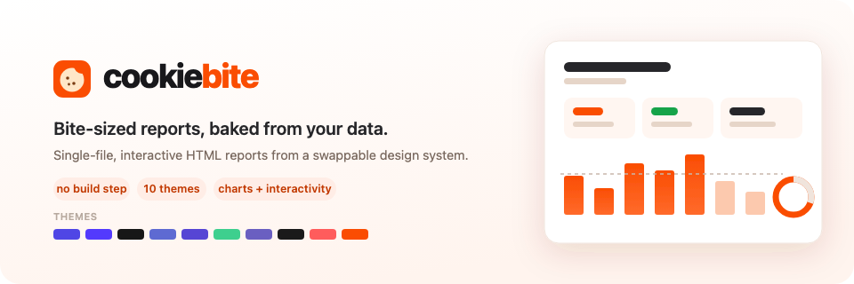
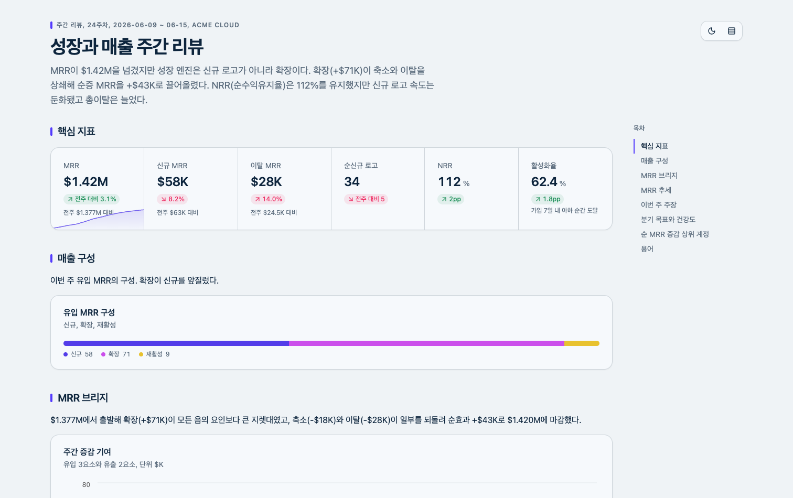
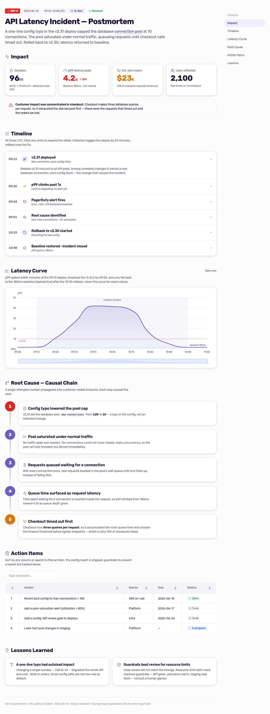
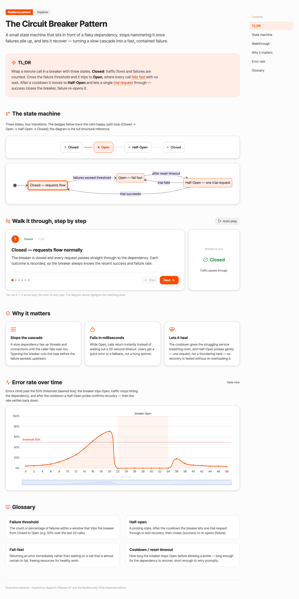
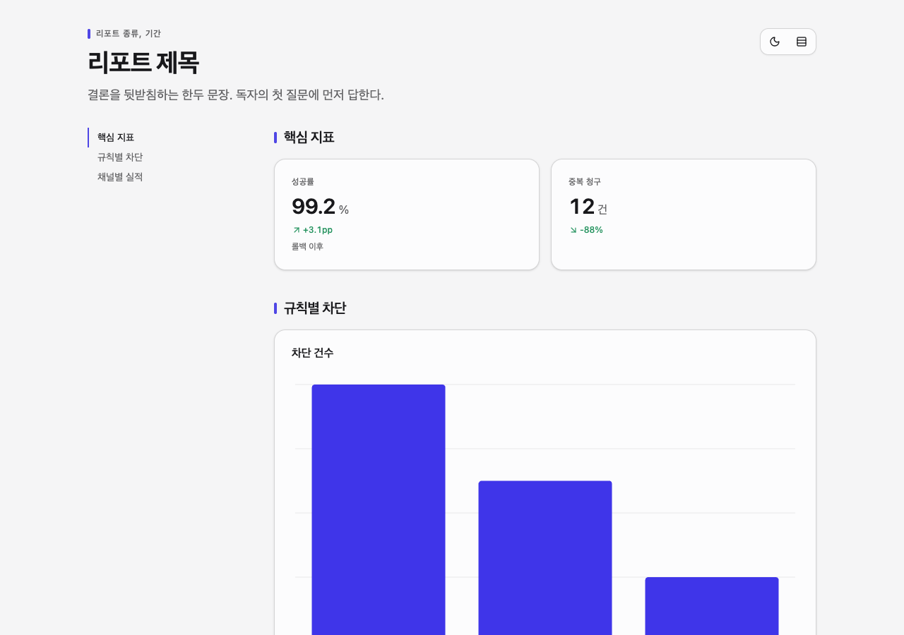
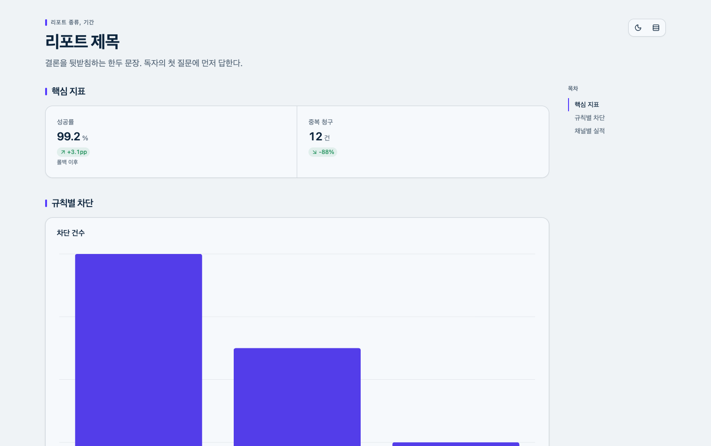
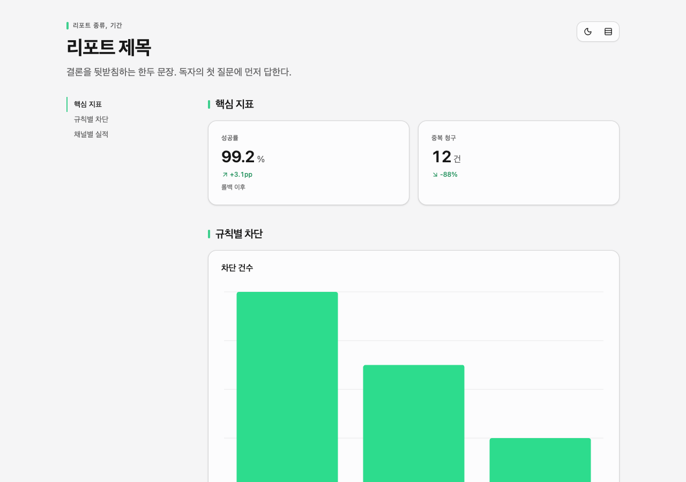
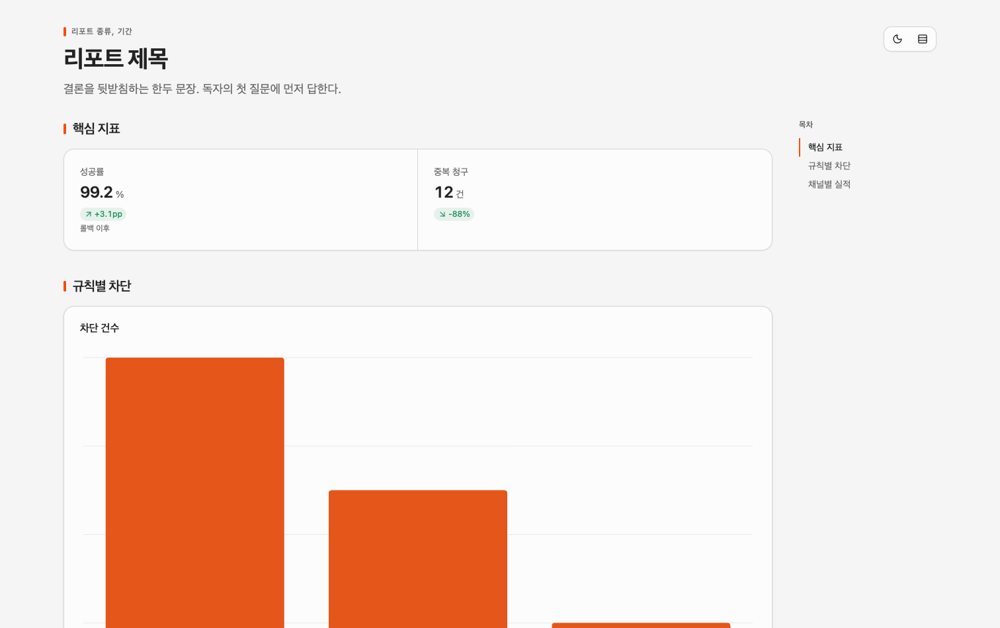
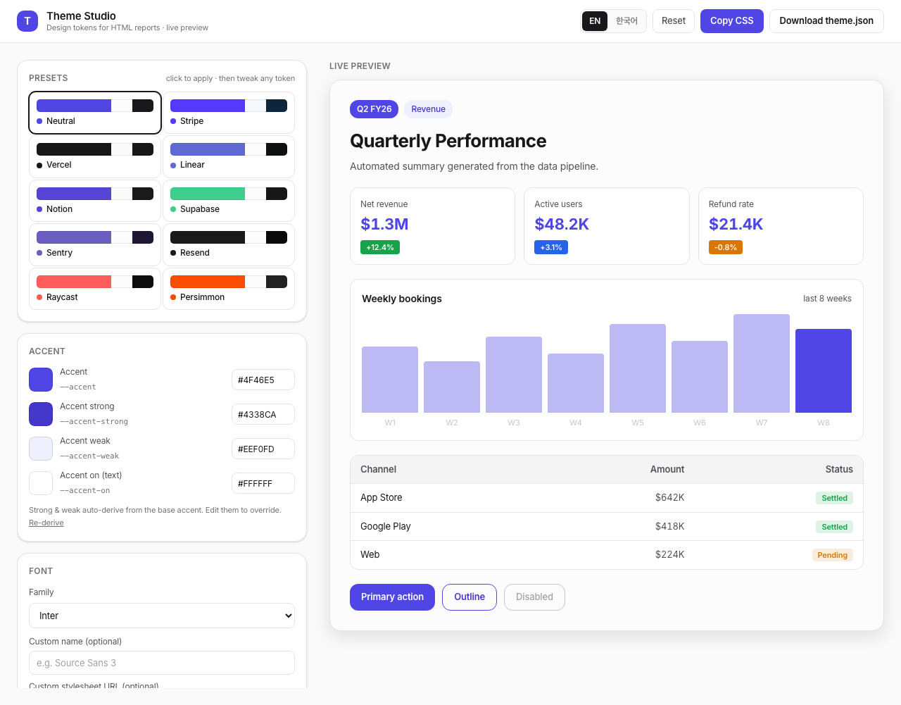

<p align="center">
  
</p>

<p align="center">
  
  
  
  
  
</p>

<p align="center">
  <strong>한국어 README: <a href="README.ko.md">README.ko.md</a></strong>
</p>

---

Most AI-generated reports look the same: a wall of bullet points, maybe a gray table, the occasional rainbow chart that nobody asked for. You can usually tell a model wrote it within two seconds.

cookiebite is a Claude Code skill that goes the other way. You hand it data — metrics, an incident, research notes, a weekly recap — and by default it builds a single self-contained HTML file you'd actually want to *read*: a quiet reading document of author-owned semantic HTML, with a table of contents where it earns one. Richer behavior — charts, sortable tables, glossary tooltips, motion, export — is opt-in, pulled in only when the report asks for it. One file, no build step, no server. Double-click it, email it, drop it in Slack.

It also renders the page and *looks at it* before handing it over, so the labels don't overlap and the charts aren't broken. That part matters more than it sounds.

<p align="center">
  <strong>▶ <a href="https://korECM.github.io/cookiebite/">See the examples live</a></strong> — open them in your browser and poke around.
</p>

## Quickstart

Write a typed TSX report; `cookiebite build` renders a single self-contained HTML file.
The build enforces the visual contract — token colors, chart aria labels, declared
capabilities — so you focus on the story:

```bash
bunx cookiebite new report.tsx           # typed starter
bunx cookiebite build report.tsx         # typecheck + lint → report.html
bunx cookiebite verify report.html --runs 3
```

Import components from `cookiebite` and themes from `cookiebite/themes`. Colors must be
`var(--cb-*)` tokens (literals fail the build); raw JSX may also use semantic Tailwind
utilities (`bg-card`, `text-muted-foreground`, `border-border`, `bg-primary`,
`text-primary-foreground`) — palette steps and arbitrary colors do not compile.
`<Report>` ships dark and density toggles by default (`controls={false}` to hide).
Every theme gets dark tokens (auto-derived when omitted). Charts use a flint semantic spec
(`type`, `semanticTypes`, `encodings`, `ariaLabel`); data keys must be English
identifiers. Twelve components cover the document shell, KPIs, claims, findings, tables,
glossary, and charts — see
[packages/cookiebite/README.md](packages/cookiebite/README.md). The full contract lives in
[DESIGN.md](DESIGN.md).

Worked TSX examples: [weekly-revenue.tsx](docs/examples-tsx/weekly-revenue.tsx),
[incident-postmortem.tsx](docs/examples-tsx/incident-postmortem.tsx).

## Legacy (rebuilding existing reports only)

The older freeform path still works **only for rebuilding reports that already use it** —
do not start new reports here:

```bash
bash scripts/scaffold.sh report.html    # quiet reading skeleton — core runtime only
# edit report.html: write sections, declare capabilities in <!-- COOKIEBITE:USE -->
bash scripts/inline.sh report.html      # assemble ONLY the dependencies you declared
```

Behavior is opt-in through `<!-- COOKIEBITE:USE -->`. Name `chart`, `table`, `glossary`,
`motion`, or `export` and only those ship. For full-runtime compatibility templates:

```bash
bash scripts/scaffold.sh dashboard report.html   # or: review, postmortem, explainer, comparison
```

Those five render with `assets/cookiebite.css` / `assets/cookiebite.js` — the rich
reports shown below.

## What it makes

Three reports from the same skill — different data, one Persimmon theme:

| Weekly growth dashboard | Incident postmortem | Circuit-breaker explainer |
|:---:|:---:|:---:|
|  |  |  |
| Persimmon theme. An MRR waterfall, a signup funnel, a cohort retention heatmap, a goal gauge, and a sortable accounts table. | Persimmon theme. Impact summary, expandable timeline, a zoomable latency curve, a numbered root-cause chain, an action table. | Persimmon theme. A Mermaid state diagram, a click-through walkthrough that highlights each state, and a glossary. |

All three are in [docs/examples/](docs/examples/) — open them and poke around: zoom a chart, click through the walkthrough, sort the table, hover the dotted terms.

And because it's HTML, a report can *move* when motion earns it. Here a circuit breaker cycles through its states — Closed, Open, Half-Open — the active one glowing as it goes. Built natively, not an embedded GIF:

<p align="center">
  
</p>

## Ten themes, or your own

The whole look comes from a small set of design tokens (one accent, a neutral ramp, semantic colors, a font). Swap the tokens and the entire report re-themes. Ten presets ship in the box — a clean neutral default plus nine distilled from real design systems:

| | | | |
|:---:|:---:|:---:|:---:|
| <br>Neutral | <br>Stripe | <br>Supabase | <br>Persimmon |

Want your own palette? Open the theme studio. Pick a preset, nudge the accent, change the font, watch a live preview update as you go, then export the theme as a CSS block or a JSON file.

<p align="center">
  
</p>

## What goes into a report

When a report opts into behavior — or you scaffold a full-runtime type — this is what it draws on:

- **Charts over text.** When a point can be a chart, a stat card, a timeline, or a diagram, it becomes one. ECharts for the rich stuff, Chart.js when something simpler will do.
- **Things you can poke.** Filters, view toggles, sortable tables, drilldowns, an expandable timeline. A static chart answers one question; an interactive one answers the ones you didn't think to ask.
- **Glossary tooltips.** Hover a technical term and get a plain-language definition. The expert skims past it; everyone else gets a hand.
- **Numbers that read right.** Thousands separators, currency units, a fixed decimal precision, deltas with the correct sign. Tabular figures so columns line up.
- **Accessible by default.** Status is never color alone — it gets an icon and a label too. Every chart has a "view as table" toggle and an aria-label.

## How it stays good

The skill renders each report in a headless browser and screenshots it in slices — desktop,
a narrow width, and **always a dark pass** (every theme ships dark tokens) — then reads
those slices and checks them. Overlapping labels, clipped text, a collapsed chart, a layout
that breaks on a phone: none of that shows up in the HTML source or a syntax check. The only
way to catch it is to look, so the skill looks, fixes what it finds, and looks again. The
screenshot tool it uses is [agent-browser](https://github.com/built-by-as/agent-browser).

Colors get the same treatment, but computed instead of eyeballed: every palette a report generates is judged by a bundled validator — colorblind separation (Machado CVD simulation + CIEDE2000), lightness band, chroma floor, contrast against the actual surface — and the verdicts land in the same checks file the skill already reads. The finished report is also swept against a catalog of chart anti-patterns (dual axes, value-ramps on unordered categories, a number on every point, and friends) before it ships.

## Install

Add it with the [skills](https://github.com/vercel-labs/skills) CLI — the standard way to install an agent skill:

```bash
npx skills add korECM/cookiebite
```

Prefer git? Clone it straight into your skills directory:

```bash
git clone https://github.com/korECM/cookiebite ~/.claude/skills/cookiebite
```

The install ships a nested theme skill inside the skill directory; it resolves cookiebite's asset directory as a sibling, so theming keeps working from a copied installation.

For the visual self-check and the theme studio screenshots, put [agent-browser](https://github.com/built-by-as/agent-browser) on your PATH. Without it the skill still writes reports — it just can't see them.

**Make Claude reach for it automatically.** The skill already triggers on report-shaped requests, but you can nudge it harder by adding a line to your `CLAUDE.md`:

```md
For any HTML report, dashboard, or a request to visualize / lay out data as a page, use the cookiebite skill.
```

**Slash commands (optional, but reliable).** The repo ships three commands — `/cookiebite`, `/cookiebite-theme`, `/cookiebite-apply` — as a deterministic alternative to auto-triggering. If your installer didn't place them, copy them into your commands directory:

```bash
mkdir -p ~/.claude/commands && cp ~/.claude/skills/cookiebite/commands/*.md ~/.claude/commands/
```

## Use it

In Claude Code, just ask. The skills trigger on report-shaped requests even when you never say the word "report":

> summarize last week's signup and revenue numbers as an html page

> turn these incident notes into a postmortem I can share

> make a one-pager from this CSV, use the Linear theme

Auto-triggering isn't guaranteed, though. When you want it to fire for sure, name the skill ("use cookiebite to…") or run the matching slash command — the commands always work:

| You want to… | Just say (may auto-trigger) | Or run (always works) |
|---|---|---|
| Build a report | "summarize these as an html page" | `/cookiebite <data or ask>` |
| Open the theme studio | "open the theme studio", "edit my theme" | `/cookiebite-theme` |
| Apply a designed theme | paste the studio's "Copy for agent" output | `/cookiebite-apply <theme>` |

In the theme studio you design the look, then export with **Set as my default** (every future report) or **Copy for agent** (one report) and paste that back — or hand it to `/cookiebite-apply`. To open the studio by hand, the file is `assets/theme-studio.html`.

## Related

The case for HTML as an output medium, with a gallery of twenty examples spanning planning, code review, design, decks, and reports, is made well in [The unreasonable effectiveness of HTML](https://thariqs.github.io/html-effectiveness/). The side-by-side comparison, state-export, explainer, and inline-SVG patterns here borrow from it.

## Credits

The brand theme presets (Stripe, Vercel, Linear, Notion, Supabase, Sentry, Resend, Raycast) are distilled from the design specs in [voltagent/awesome-design-md](https://github.com/voltagent/awesome-design-md) (MIT), remapped to a light report surface with free web fonts. They're interpretations for theming, not official brand assets — each brand owns its trademarks.

The full-runtime reports build on [Tailwind](https://tailwindcss.com), [ECharts](https://echarts.apache.org), [Alpine.js](https://alpinejs.dev), [Tippy.js](https://atomiks.github.io/tippyjs/), [CountUp.js](https://github.com/inorganik/countUp.js), and [Lucide](https://lucide.dev) — all over CDN. A reading report loads none of these up front; `inline.sh` assembles only the libraries its declared capabilities actually need.

## License

MIT. See [LICENSE](LICENSE).
